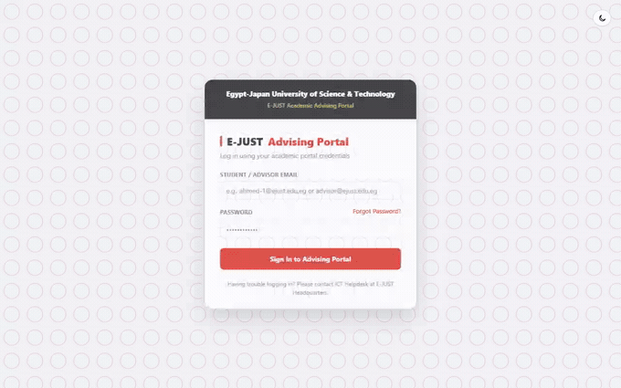
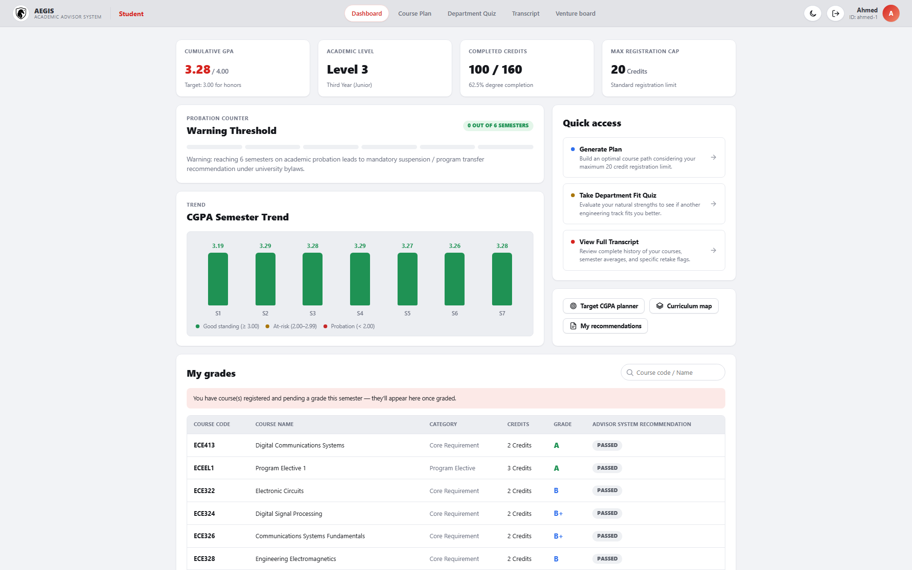
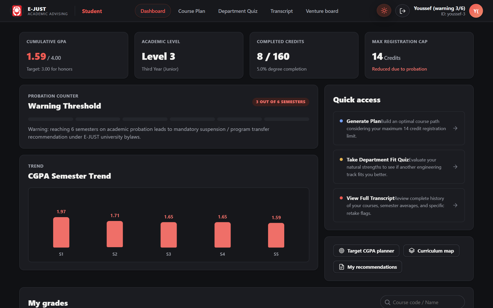
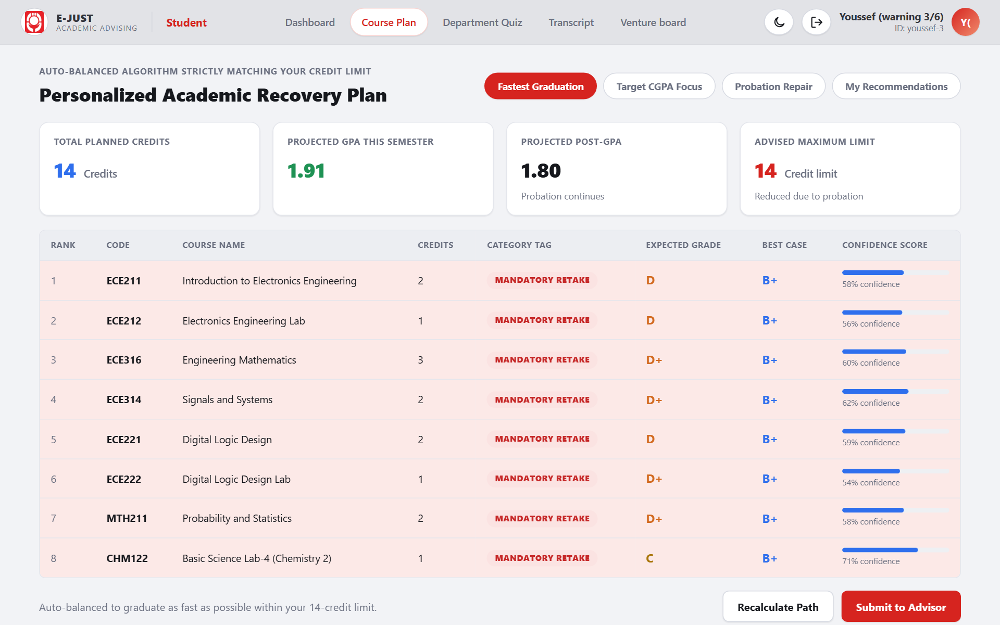
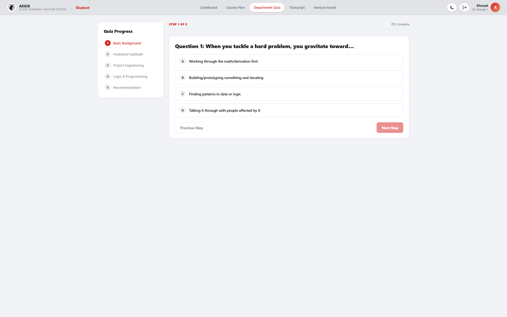
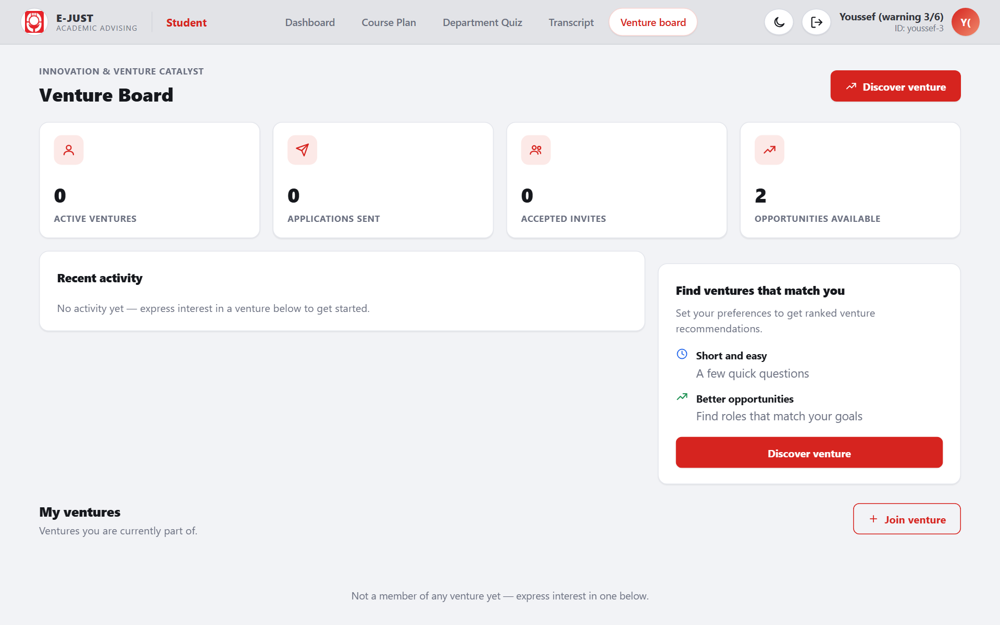
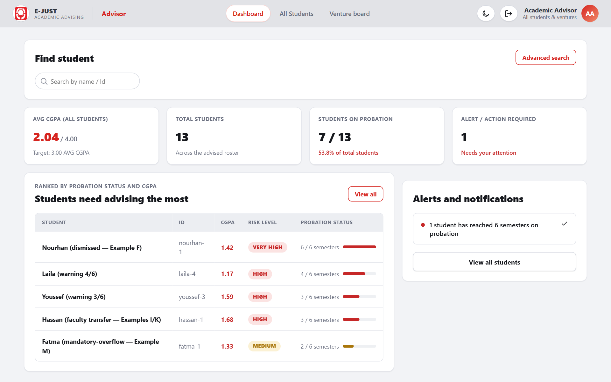
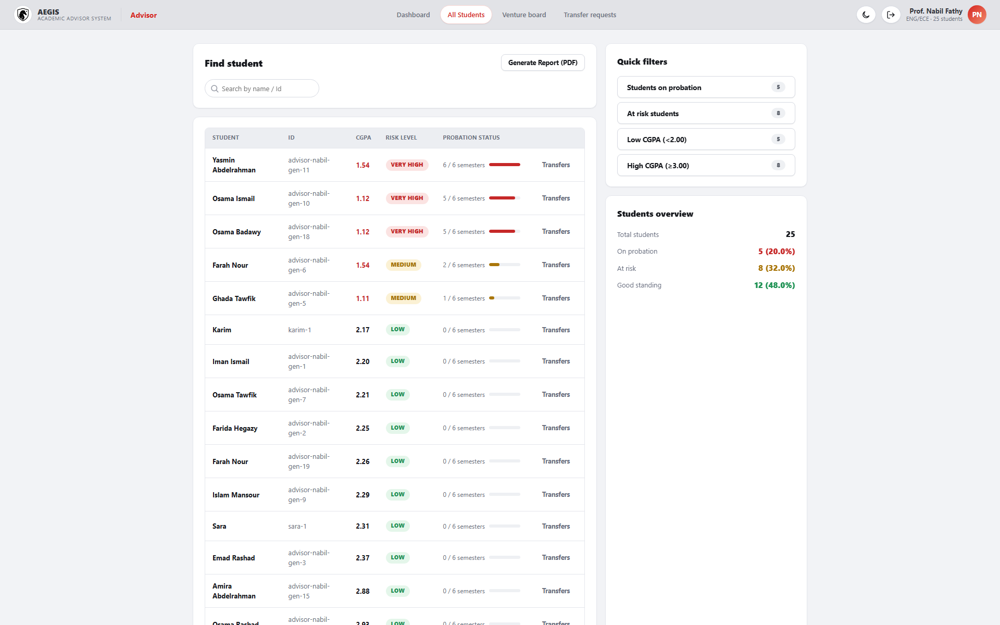
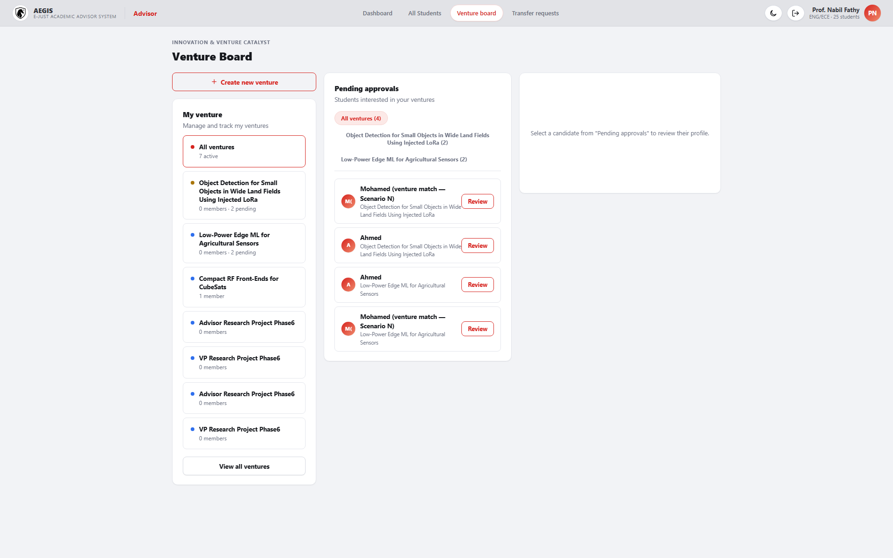

<div align="center">

# Academic Advising & Early-Warning System

**Mohamed Elsayed Elhariry** — Department of Electronics and Communication Engineering<br>
**Yamen Hany Ezzat** — Department of Digital Media, Faculty of Art and Design<br>
*Egypt-Japan University of Science and Technology (E-JUST)*

[](https://github.com/5636mohamed/academic-advisor/actions/workflows/ci.yml)
[](https://github.com/5636mohamed/academic-advisor/actions/workflows/pages.yml)
[](https://github.com/5636mohamed/academic-advisor/releases/latest)
[](LICENSE)
[](https://5636mohamed.github.io/academic-advisor/)
[](https://academic-advisor-api-production.up.railway.app/)

</div>

### 🔗 Live demo — try it now

**https://5636mohamed.github.io/academic-advisor/**

The real, fully working system — not a static mockup. Frontend on GitHub
Pages, backend API live on Railway; log in with any credential from
`docs/LOGIN_CREDENTIALS.md` (advisor: `advisor@ejust.edu.eg` / `admin`) and
click through the real dashboard, course plans, and venture board with real
seeded data. The API's free tier can spin down after a period of
inactivity — the very first request after a quiet stretch may take up to
~30–60 seconds to wake back up; every request after that is normal speed.
(The **api** badge above does a real live check on every page load, so it
can briefly show *offline* right as the API is waking from that idle
state — not a sign anything's actually broken, just the free tier's cold
start racing the badge's own timeout.)

Implementation of `docs/BUILD_SPEC.md` — the full specification for the
probation/dismissal state machine, retake-gate planning, department/faculty
best-fit engine, internal/external transfer execution, a role-restricted
student portal, best-case grade projection, a dual advisor/student course
approval-and-registration workflow, advisor PDF reporting (§15), and the
Innovation & Venture Catalyst — a research/spin-off matching engine with its
own student, advisor, and Faculty Console surfaces (§16).

## Screenshots

The student portal, advisor console, **and** Faculty Console were all
redesigned to match the project's E-JUST UI mockups (`UI Design Student/`,
`UI Design Professor/`) — one shared red/white design system, dark mode
throughout, smooth transitions on every interactive surface, and verified
responsive from mobile (375px) through desktop across all three portals.

### Live demo

Recorded straight off the running app (Playwright, headless Chromium) —
login → dashboard → course plan → department quiz → venture board → dark
mode, and the equivalent advisor flow, each real navigation and real data,
not a mockup.

| Student portal | Advisor console |
|---|---|
|  |  |

### Static screenshots

**Student portal**

| Dashboard | Dashboard (dark mode) |
|---|---|
|  |  |

| Course Plan | Department Quiz | Venture Board |
|---|---|---|
|  |  |  |

**Advisor console**

| Dashboard | All Students | Venture Board |
|---|---|---|
|  |  |  |

## Status
See `PROGRESS.md` for exactly what is implemented vs. still to be built, and
which spec section each file maps to (read the newest "SESSION N NOTE" at
the top first). On top of the core engine (grading, prediction,
probation/dismissal, retake gate, department/faculty fit, transfer
execution, the full advisor/student frontend, best-case grading, and real
advisor/student/professor access separation):

- **§16 Innovation & Venture Catalyst** — a `ventureFitScore` weighted-sum
  engine (course competency / skill alignment / academic trajectory)
  matches students to professors' research projects and commercial
  spin-offs. The Venture Gate + Interest Form live entirely on each
  student's own **Venture Board** tab — never inside Course Plan, which
  shows course recommendations only; venture/project matches are never
  mixed into it. On the advisor side, the advisor owns and manages every
  venture directly (post/edit/archive, review candidates) rather than
  browsing a per-professor directory. Professors get their own **Faculty
  Console** (`/faculty/:professorId`) to post projects and review a
  ranked, auto-generated candidate list — each row's CV opens in a
  near-fullscreen, in-page viewer (never a download), with a Close button
  that turns the brand accent color on hover. Every Level 3+, non-dismissed
  demo student — Mohamed included — comes with a pre-seeded Venture Gate
  opt-in, so the whole eligible cohort shows up ranked from a cold boot;
  Level 1–2 students never see the gate at all (real eligibility rule) and
  a dismissed student is 403'd from venture matching same as every other
  self-service route.
- **Night mode** — a systemwide light/dark theme (§9.4), not just one
  page: every color in the app is a CSS custom property with a dark
  counterpart, toggled from a button in every masthead (and the login
  page). Defaults to the OS's `prefers-color-scheme`, remembers an
  explicit choice across visits.
- **Three-way access separation** — advisor, student, and (as of this
  session) professor are enforced-separate parties: a demo login at
  `/login` picks one identity, and route guards bounce any session away
  from another party's pages, not just hide the links to them.
- **Student portal** (`/portal/:studentId`) — the student's own restricted
  view of the same engine: letters only, never a raw percentage, per §15.1.
- **Best-case grade projection** (§15.2) — alongside every course's
  realistic expected grade, a "if you performed like your best semester"
  optimistic grade and its real CGPA impact, shown in both the advisor and
  student views.
- **Course proposal / dual-approval workflow** (§15.3) — the advisor
  reviews the system's recommended courses, can approve them or swap in an
  alternate (scored live by the same prediction engine, always excluding
  the system's own recommendation from the alternate picker — that's not
  a real alternative); the student sees both options and picks one —
  picking the advisor-approved option registers it immediately, picking
  the other prompts a "contact your advisor" popup instead. A one-click
  **Approve all** bulk-approves every still-pending recommendation at
  once, and a **Modified Plan** summary shows the advisor exactly what the
  student is about to see before they do, flagging anything still
  unreviewed.
- **Advisor PDF report** (§15.4) — one click in the Advisor Console exports
  a roster PDF with each student's pending / advisor-approved / registered
  course counts.

See `PROGRESS.md`'s newest session note for exact test counts and what's
still a documented simplification (no real login backend, in-memory
store, etc.).

## Structure

Three npm workspace packages ("subspaces" of the monorepo) — each is its
own `package.json` with its own version, but none are published to a
registry (all `"private": true`); the badges just identify which package
is which at a glance.

[](packages/shared)
[](packages/api)
[](packages/web)

```
packages/
  shared/   → @advisor/shared — types + grading tables shared by api & web
  api/      → @advisor/api — Node/TS backend: grading, prediction, probation,
              retake-gate, fit-engine, transfer-execution, proposal, and
              venture-matching modules + the full HTTP API (src/server.ts)
              over an in-memory data layer
  web/      → @advisor/web — React/TS frontend — Vite + React Router. Three
              route trees: the advisor app, the student portal
              (/portal/:id), and the Faculty Console (/faculty/:id), each
              behind its own auth guard
docs/
  BUILD_SPEC.md      → full specification (the single source of truth)
  HANDBOOK_RULES.md  → every business rule restated in plain language, cross-referenced to code
  DECISION_TREE.md   → the advising-cycle branch logic as a diagram
```

## Tech Stack

### Frontend

[](https://react.dev/)
[](https://reactrouter.com/)
[](https://vitejs.dev/)
[](https://www.typescriptlang.org/)

### Backend

[](https://nodejs.org/)
[](https://expressjs.com/)
[](https://www.typescriptlang.org/)
[](https://www.prisma.io/)

### Prediction engine

[](packages/api/src/modules/prediction/linearRegression.ts)
[](packages/api/src/modules/prediction/cgpaTrendProjection.ts)

Every trend projection in the system — cohort grade trends, an individual
student's own ability trend, and CGPA trajectory — is driven by a small,
dependency-free **Ordinary Least Squares linear regression** implementation
(`packages/api/src/modules/prediction/linearRegression.ts`'s `ols()`,
fitting `y = a + b·x` over a student's or cohort's own history, then
projecting the next term). No ML library — just the real math, unit-tested
directly (`test/unit/prediction/linearRegression.test.ts`) and reused by
every one of `cgpaTrendProjection.ts`, `cohortTrend.ts`, and
`studentTrend.ts` so cohort, individual, and CGPA trends can never compute
a trend line differently from one another.

### Testing & tooling

[](https://vitest.dev/)
[](https://playwright.dev/)
[](https://docs.npmjs.com/cli/v10/using-npm/workspaces)

### Packages used

Every package actually in `package.json` across the three workspaces, and
what it's for. All three of *this project's own* workspace packages are
also published to
[GitHub Packages](https://github.com/5636mohamed/academic-advisor/packages)
(`.github/workflows/publish-packages.yml`, on every GitHub Release) under
`@5636mohamed/academic-advisor-{shared,api,web}` — `-shared` is the one
genuinely meant for reuse (types + grading tables); `-api`/`-web` are
published for visibility more than as installable libraries, since one's
a server and the other's a full application. Installing from GitHub
Packages (unlike the public npm registry) always needs a GitHub token
with `read:packages`, even for a public repo like this one — see
[GitHub's docs](https://docs.github.com/en/packages/working-with-a-github-packages-registry/working-with-the-npm-registry#installing-a-package)
if you want to pull one down yourself.

**Frontend (`packages/web`)**

| Package | Version | Used for |
|---|---|---|
| `react` / `react-dom` | 18.3 | UI |
| `react-router-dom` | 6.26 | Client-side routing — three separate route trees (advisor, student, faculty), each behind its own `RequireRole` guard |
| `vite` | 5.4 | Dev server and production build |
| `@vitejs/plugin-react` | 4.3 | Vite's React integration (JSX/Fast Refresh) |
| `jspdf` + `jspdf-autotable` | 4.2 / 5.0 | Client-side advisor roster PDF export (§15.4) |
| `typescript` | 5.5 | Type-checking (`npm run typecheck`) |
| `playwright` *(dev)* | 1.62 | Screenshot/E2E verification during development — not shipped in the built app |
| `ffmpeg-static` *(dev)* | 5.3 | Generates this README's demo GIFs from Playwright recordings |

**Backend (`packages/api`)**

| Package | Version | Used for |
|---|---|---|
| `express` | 4.19 | HTTP API (`src/server.ts`) |
| `@prisma/client` / `prisma` | 5.18 | A real schema is scaffolded (`src/db/prisma/schema.prisma`) for the eventual database layer — the live app currently runs on an in-memory store (`db/memory/inMemoryDb.ts`), a documented simplification, not a hidden gap |
| `tsx` | 4.16 | Runs the server directly from TypeScript source, in both dev (`tsx watch`) **and** the deployed production `start` script — see the Deployment section below for why |
| `typescript` | 5.5 | Type-checking / the `build` script (used as a CI gate; its compiled output isn't what actually runs — `tsx` is) |
| `vitest` | 2.0 | Unit tests — 187 passing, run in CI on every push |

**Shared (`packages/shared`)** — plain TypeScript types and grading tables imported directly as source by both `api` and `web` (no build step of its own); only dependency is `typescript` for its own type-checking.

**Root** — `npm workspaces` for monorepo package management across all three, no extra tooling (Lerna/Nx/Turborepo) needed at this size.

### Hosting & CI

[](https://pages.github.com/)
[](https://railway.com/)
[](https://github.com/5636mohamed/academic-advisor/actions)

| Piece | Platform | How |
|---|---|---|
| Frontend (`packages/web`) | GitHub Pages | Auto-built and deployed on every push to `master` by `.github/workflows/pages.yml` |
| Backend (`packages/api`) | Railway | Free tier; `railway.json` at the repo root configures the build/start commands. `render.yaml` is also included as a ready-to-go alternative |
| Tests & type-checking | GitHub Actions | `.github/workflows/ci.yml` runs the backend suite plus `shared`/`web` type-checks on every push and pull request — the "tests" badge at the top of this README reflects this workflow's real, current status |

See [Deployment](#deployment) below for how the two live pieces are wired together.

## Getting started
```bash
npm install --workspaces

# backend — tests + API server
cd packages/api
npx vitest run                # 187 tests
npx tsx src/server.ts         # API on http://localhost:3001

# frontend — in a second terminal
cd packages/web
npx vite                      # app on http://localhost:5173, proxies /api to :3001
```

Open `http://localhost:5173/login` and sign in with a real email + password
(still a demo gate — client-side only, no server-side session) — the
Advisor, a student, or a professor. The full credential roster (every
student/professor email is derived straight from their real seeded id) is
in `docs/LOGIN_CREDENTIALS.md`. The demo roster includes personas for
every worked example in spec §11 (a good-standing student, a mid-probation
warning-ladder student, a mandatory-retake-overflow case, a dismissed
student, a faculty-transfer candidate, **Mohamed for the §16 venture-match
scenario**, etc.) so every branch of the system is reachable through the
UI, not just through unit tests.

No `node_modules` are committed. `npm install --workspaces` installs
everything (Express, Vitest, React, Vite, jsPDF, Prisma client, etc.)
across all three workspace packages.

## Deployment

The live demo linked near the top of this README is two separately-deployed
pieces, wired together with CORS:

- **`packages/web`** (the frontend) → **GitHub Pages**, built and deployed
  automatically on every push to `master` by
  `.github/workflows/pages.yml`.
- **`packages/api`** (the backend) → **Railway**, since GitHub Pages only
  serves static files and can't run a real Node server. `railway.json`
  configures the build/start commands (this is an npm-workspaces monorepo,
  so the install step has to run from the repo root, not per-package).

The frontend build is pointed at the live API via a `VITE_API_BASE_URL`
GitHub Actions repo variable — if the Railway URL ever changes, update
that variable and re-run the Pages workflow. `render.yaml` is also in the
repo as a ready-to-go alternative if you'd rather deploy the API to Render
instead of Railway.

## Authors

**Mohamed Elsayed Elhariry**<br>
Department of Electronics and Communication Engineering<br>
Egypt-Japan University of Science and Technology (E-JUST)

**Yamen Hany Ezzat**<br>
Department of Digital Media, Faculty of Art and Design<br>
Egypt-Japan University of Science and Technology (E-JUST)

## Contributing

Contributions are welcome — see [CONTRIBUTING.md](.github/CONTRIBUTING.md)
for local setup, coding conventions, and how to submit a pull request. This
project follows a [Code of Conduct](.github/CODE_OF_CONDUCT.md).

## Security

See [SECURITY.md](.github/SECURITY.md) for the project's supported version,
known limitations, and how to privately report a vulnerability.

## License

Licensed under the [Apache License, Version 2.0](LICENSE).
