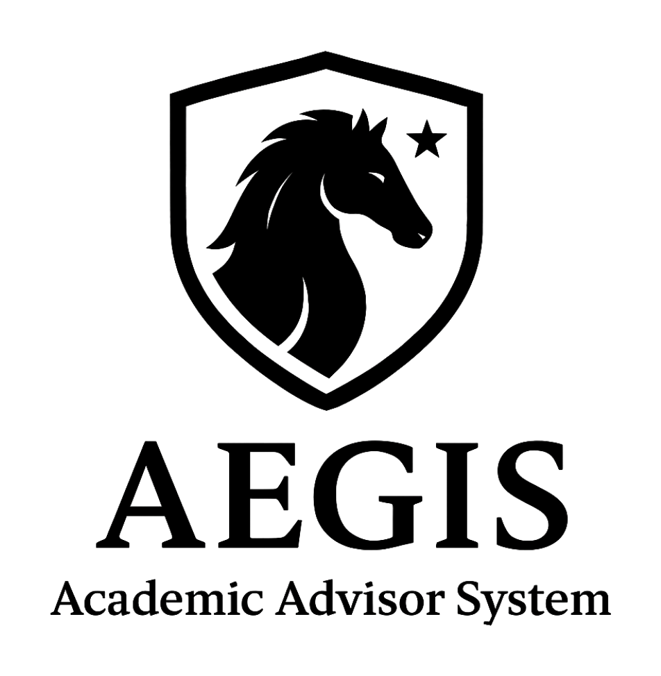
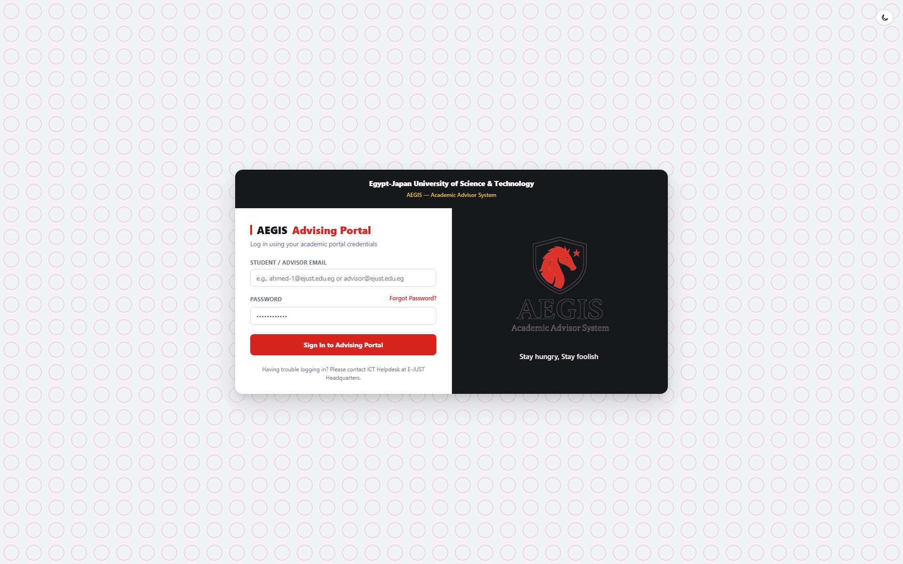
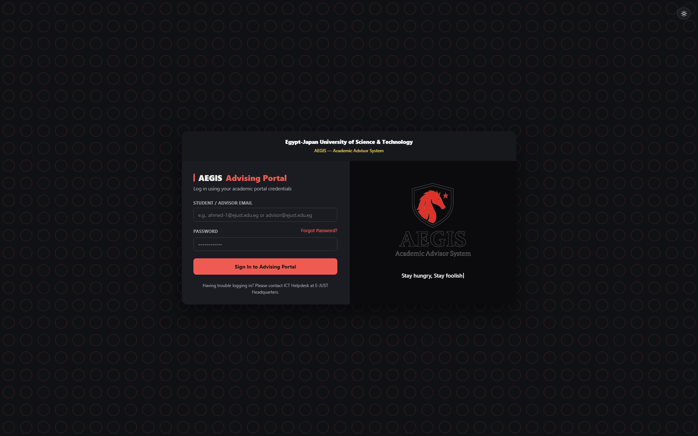
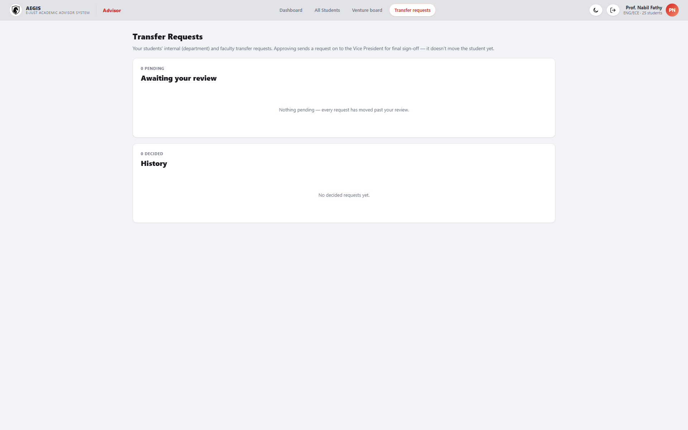
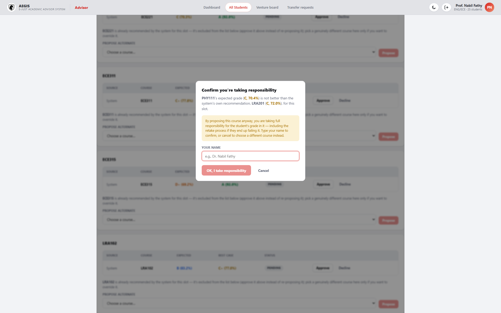
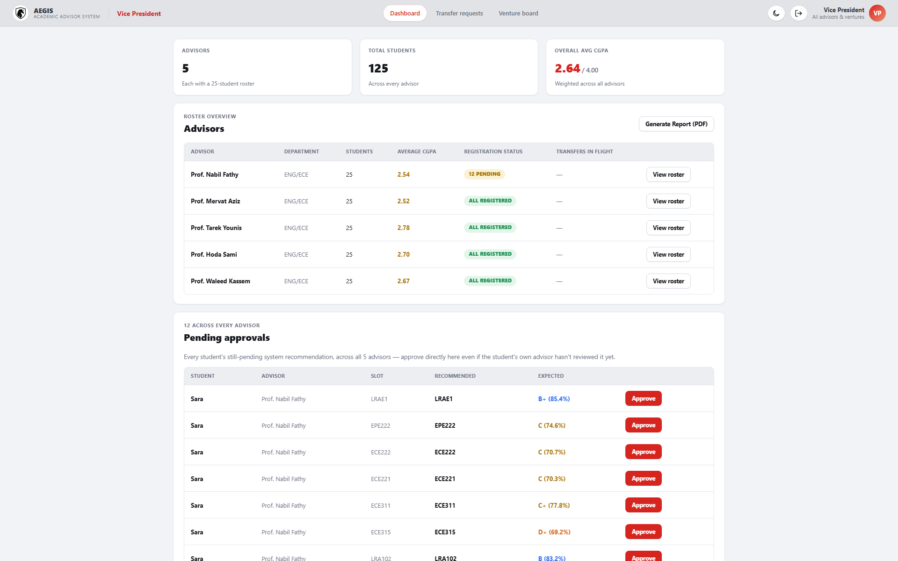
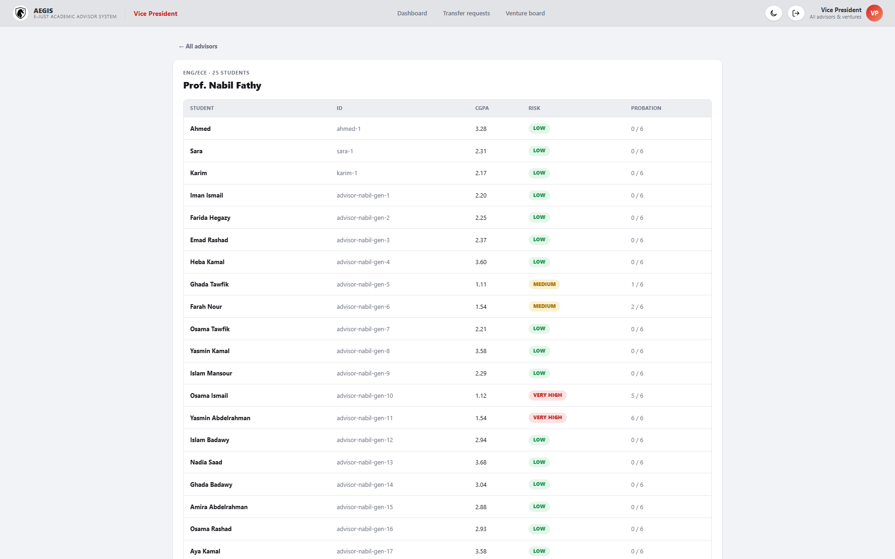
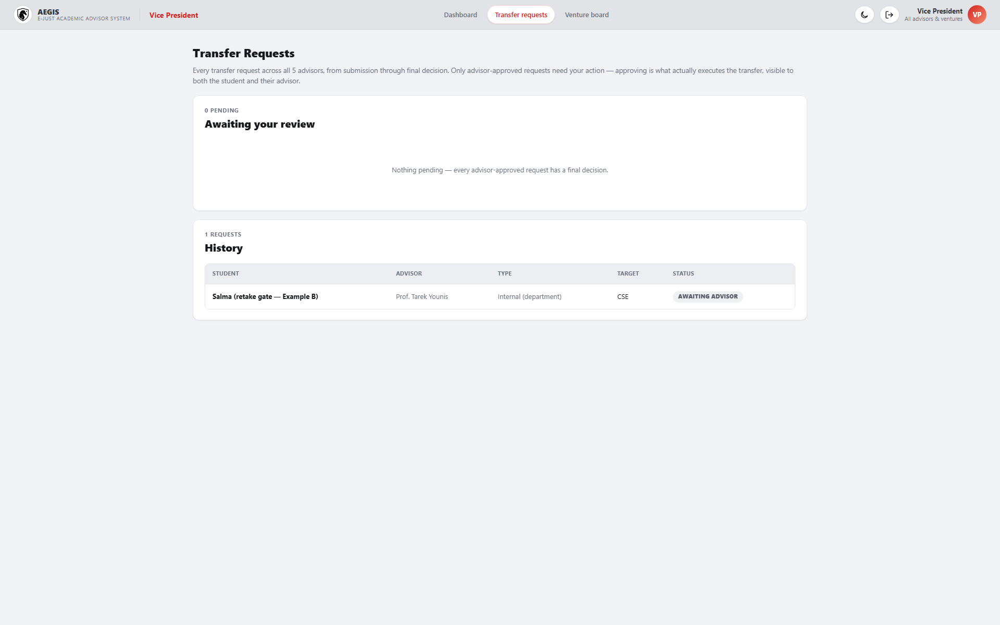

# AEGIS — Academic Advising & Early-Warning System 

**Mohamed Elsayed Elhariry** — Department of Electronics and Communication, Faculty of Engineering, Egypt-Japan University of Science and Technology (E-JUST) 
**Yamen Hany Ezzat** — Department of Digital Media, Faculty of Art and Design, Egypt-Japan University of Science and Technology (E-JUST) 

[![Release](https://img.shields.io/github/v/release/5636mohamed/academic-advisor?label=release&color=d6241f&logo=data%3Aimage%2Fpng%3Bbase64%2CiVBORw0KGgoAAAANSUhEUgAAABQAAAAWCAYAAADAQbwGAAAAAXNSR0IArs4c6QAAAARnQU1BAACxjwv8YQUAAAAJcEhZcwAADsMAAA7DAcdvqGQAAAQuSURBVDhPvVTvTxt1GC9b3YAJykAKbDIXl5jQll5%2F33GFDiizC8g0gReggRgTZgxxIfwBp29MjJCQdWs4itb2oOTOlTSNISIkfecLf%2F%2BYjiF3hdJCEQpuMtEt62Oesmsq2TS%2B8ZNc7nvfe57P9%2FN8nx8Kxf%2BNmZmZo%2BOh8aLp6elSQRAeFwThyEGbf0QkElGio8%2FnKw0EAlUTExOnBEGoxre8DnJc5eTkZEk4HC4UBOHwQQ4FnurxeI4HAgEVx3Enp6amnsGH5%2FkTSKwAUHYCHOY4rpjn%2BafQxu%2F3n742MXEKbXAPD8iq9%2Fv95WNjYyd9Prba6%2FVWeL3eJ3meL5AP3LrYcyI9MJD9RqA6tPMEAiqfz1eNxCgo89PtdpdwHFfJsuxjuU6i026LtzRcjp0lN9cpIrHmqL98o6O9PZZzGIKJRJQul6sK7zmz4XK5SlF2rtFCf%2F%2Fp%2BLn6xV2KgFVDDSRMGtgldbBOG7el9ucvgUKRt9ja0hFtdQxGGSb%2FHZ%2BvNBwOl2Wc8f4wbJlMbHNUJ2ymz%2BJm7X3JqIYVEz4aEI1q2CN1EKWN%2Foydo%2BFDqYn%2BOjYwUDDEsmVZwuHh4Szh%2BuDgsaUW%2B6e7lA5WkMyoBokkfpXqjNtxQw1EKSIVbTBvL7fUNyXffE0VfaO3IsIwSrfbXf5QhTfG3y0S7eRPSZMaRJt5c8NSC2KDeVaiDd%2FftmhBNGvubtbp70q06SM5IsTIyIjqoYSis9mctNaCZKm9LdrJH7cwVIr4aqW1uXejzhDdIXWQMmtghdTdWujq2ifYT2z53NzcflIwO9zoaGWG0G59%2Bw5ZCyJtTIm0YStmqIEdkoDl841NEYbJX2ume%2BKUPv4HRYBkt06C3a5EP6ySTM3KCkeDwcqFvq4yidKLSZMmLdHGP0VKfy9qqIEUhkob5mU1P7zofHaFNv62ZLd%2Bm2hrK2QY5hDWItZlxsDv9x97b3a2%2FOarr%2BhiDtu1VZLYWzapQTJpYPlBYuJWXTp24bxWJr3%2Bwrkziy87i3EdCoWKsC2zzYAnYN8qAPKWGsmrdyhdpkRQnWgz%2Fi6atfdvWWtBrDd%2FIBPKAIC8YDBYiSHjOvsD%2B3QoEin7%2FNLrz61SRHzTooWEUQ1LZ6nvRIpY%2BwUVk0Tyy76%2BwlxCnuePY7g4UHL3EXnYi2fS6aPf9HQ3JikiBXUELDls7%2F9MEjczZWTV7UV7eytkB0EQnpCHw9%2BpHgALFEPvSKcLvui%2FaNlqIN1Rp30gbtHCBpYPSSSud3YewavBjOLUQRHAMIcOcmXBMIwSS4jZ2clkTHqptT1Vp4%2Feo%2FXYcm%2FhGEMSlmWrPR6PCgAeTSYDLxcV4EhjttLFn1wdejrWcaE75HJVeYWPK1AZltpBv38FlgGq8czPq7oBSsZDoSrvlSs4L%2FMP2v4nsCxbiIpzh%2B6j8BcneUZNhdaojQAAAABJRU5ErkJggg%3D%3D)](https://github.com/5636mohamed/academic-advisor/releases/latest)

> 🔱 **Forked as an EJUST edition.** A private, EJUST-branded fork of
> this repository — **[`ejust-academic-advisor`](https://github.com/5636mohamed/ejust-academic-advisor)
> (v1.0.1)** — exists for Egypt-Japan University of Science and
> Technology, using EJUST's own crest as the system's primary brand mark
> throughout (login, topbars, generated PDFs, favicon) instead of AEGIS's.
> Same code, same tests, same architecture as here; it's a private repo,
> so the link above only resolves for accounts with access to it.

### 🔗 Live demo — try it now

**https://5636mohamed.github.io/academic-advisor/**

No installation, no account to create — it's the real, fully working
system running live, not a mockup or a set of static screenshots. Open the
link, log in with any credential from `docs/LOGIN_CREDENTIALS.md` — try
the Vice President (`vice-president@aegis.edu.eg` / `AEGIS@2025`) to see
the full overview across every advisor, or any of the 14 advisors (e.g.
`nabil.fathy@aegis.edu.eg` / `Advisor@123`) to see one advisor's own group
of students — and click through the dashboard, course plans, transfer
approvals, and project board with real, realistic data behind every
screen. The free hosting tier the API runs on can doze off after a quiet
stretch, so the very first click after a while might take up to a minute
to wake it up — after that, everything runs at normal speed. (The **api**
badge above checks the server live on every page load, so it can briefly
say *offline* right as it's waking up — that's the free tier's cold start
racing the badge's own check, not a sign anything is actually broken.)

## What is AEGIS?

AEGIS is a digital academic-advising assistant, built around one real
university engineering faculty's actual student handbook and course
catalog. It's for three kinds of people:

- **Students**, who get a personal dashboard that tracks their own grades
  and workload, warns them early if they're drifting toward academic
  trouble — long before it would become a formal problem — and recommends
  which courses to take next: not just any courses they're allowed to
  register for, but the ones they're realistically likely to do well in
  and that open up the most options later.
- **Advisors**, each responsible for their own group of students, who get
  an at-a-glance overview of everyone they're advising, can review and
  fine-tune the system's course suggestions before a student registers,
  and sign off on transfers between departments.
- **A Vice President–level role**, who oversees every advisor and every
  student across the whole faculty at once, without having to dig through
  each advisor's records one by one.

Beyond grades and course planning, AEGIS also connects students with real
opportunities in their field — research projects, startup ideas run by
their own advisors, competitions, internships, and funding programs — so
it works less like a report card and more like a career co-pilot that
happens to also watch out for academic trouble before it starts.

## Screenshots

The student portal, advisor console, **and** Vice President portal all
share one AEGIS red/white design system (`packages/web/src/
portal/student-theme.css`), dark mode throughout, smooth transitions on
every interactive surface, and verified responsive from mobile (375px)
through desktop across every portal.

### 🎬 Full tour (all 3 roles)

Recorded straight off the running app (Playwright, headless Chromium),
~45 seconds: the redesigned login → student portal (dashboard, course
plan, recommendations, transcript, venture board) → advisor console
(students, venture board, transfer requests, a student file) → Vice
President portal (advisor drill-down, transfer requests, venture board).
Real navigation, real seeded data throughout, not a mockup. (A
higher-quality MP4 of the same recording is also available at
`docs/media/full-tour-demo.mp4` if you'd rather watch it at full
resolution.)

### Live demo GIFs

| Student portal | Advisor console |
|---|---|
|  |  |

**The transfer approval chain, across all 3 logins** — student requests →
advisor approves → Vice President approves (the only step that actually
executes the transfer):

### Static screenshots

**Login (redesigned — two-column, typewriter quotes)**

| Light | Dark |
|---|---|
|  |  |

**Student portal**

| Dashboard | Dashboard (dark mode) |
|---|---|
|  |  |

| Course Plan | Department Quiz | Venture Board |
|---|---|---|
|  |  |  |

**Advisor console**

| Dashboard | All Students | Venture Board |
|---|---|---|
|  |  |  |

| Transfer requests queue | Advisor-responsibility confirmation modal |
|---|---|
|  |  |

**Vice President portal**

| Dashboard | Advisor drill-down | Transfer requests |
|---|---|---|
|  |  |  |

## Status
See `PROGRESS.md` for exactly what is implemented vs. still to be built, and
which spec section each file maps to (read the newest "SESSION N NOTE" at
the top first). On top of the core engine (grading, prediction,
probation/dismissal, retake gate, department/faculty fit, transfer
execution, the full advisor/student frontend, best-case grading, and real
student/advisor/Vice-President access separation):

- **§17 Multi-advisor model & Vice President oversight** — a single shared
  advisor account became 14 real advisor identities, each with their own
  25-35-student roster (real server-side scoping, not just a UI narrowing),
  and a new Vice President role oversees all 14: per-advisor summaries and
  roster drill-down, a flat cross-advisor pending-approvals queue the VP
  can act on directly, per-advisor transfer-in-flight counters, and its
  own Venture Board.
- **§17 Advisor responsibility workflow** — proposing a course whose
  expected grade is not strictly better than the system's own
  recommendation requires the advisor to type their name and confirm
  they're taking full responsibility (including the retake process on
  failure) before it's created. Once registered, a signed PDF letter is
  available to both sides, and the advisor's roster PDF report highlights
  every affected student's row with a legend explaining why.
- **§17 Transfer approval chain** — a transfer request no longer executes
  on the student's click: it has to clear the student's own advisor and
  then the Vice President, in sequence, with a decline at either stage
  ending the request untouched. The exact same §7 execution math runs
  either way — only when it runs changed.
- **§16 Innovation & Venture Catalyst** — a `ventureFitScore` weighted-sum
  engine (course competency / skill alignment / academic trajectory)
  matches students to research projects and commercial spin-offs. The
  Venture Gate + Interest Form live entirely on each student's own
  **Venture Board** tab — never inside Course Plan, which shows course
  recommendations only; venture/project matches are never mixed into it.
  There is no separate professor role: the advisor console (and the Vice
  President's own Venture Board) manage every project directly across
  every host — post/edit/archive, review a ranked, auto-generated
  candidate list, each row's CV opening in a near-fullscreen, in-page
  viewer (never a download), Accept/Decline with one click. Every Level
  3+, non-dismissed demo student — Mohamed included — comes with a
  pre-seeded Venture Gate opt-in, so the whole eligible cohort shows up
  ranked from a cold boot; Level 1–2 students never see the gate at all
  (real eligibility rule) and a dismissed student is 403'd from venture
  matching same as every other self-service route. Any project can also
  carry optional "research portal" fields (authors with links, published
  paper, conference, impact factor, lab), rendered wherever the project
  itself is shown — including the two originally-seeded professors'
  (Dr. Youssef Kamel, Dr. Salma Adel) own pre-existing projects, still
  correctly attributed even though neither has a login anymore.
- **Night mode** — a systemwide light/dark theme (§9.4), not just one
  page: every color in the app is a CSS custom property with a dark
  counterpart, toggled from a button in every masthead (and the login
  page). Defaults to the OS's `prefers-color-scheme`, remembers an
  explicit choice across visits.
- **Three-way access separation** — student, advisor (one of 14 real
  identities, each roster-scoped server-side), and Vice President are
  all enforced-separate parties (there is no separate professor role): a
  demo login at `/login` picks one identity, and route guards bounce any
  session away from another party's
  pages, not just hide the links to them (verified live via a full
  cross-role sweep — see `.github/SECURITY.md`).
- **Student portal** (`/portal/:studentId`) — the student's own restricted
  view of the same engine: letters only, never a raw percentage, per §15.1.
- **Best-case grade projection** (§15.2) — alongside every course's
  realistic expected grade, a "if you performed like your best semester"
  optimistic grade and its real CGPA impact, shown in both the advisor and
  student views.
- **Course proposal / dual-approval workflow** (§15.3) — the advisor
  reviews the system's recommended courses, can approve them or swap in an
  alternate (scored live by the same prediction engine, always excluding
  the system's own recommendation from the alternate picker — that's not
  a real alternative); the student sees both options and picks one —
  picking the advisor-approved option registers it immediately, picking
  the other prompts a "contact your advisor" popup instead. A one-click
  **Approve all** bulk-approves every still-pending recommendation at
  once, and a **Modified Plan** summary shows the advisor exactly what the
  student is about to see before they do, flagging anything still
  unreviewed.
- **Advisor PDF report** (§15.4) — one click in the Advisor Console exports
  a roster PDF with each student's pending / advisor-approved / registered
  course counts.

See `PROGRESS.md`'s newest session note for exact test counts and what's
still a documented simplification (no real login backend, in-memory
store, etc.).

## How it's put together

AEGIS is three connected pieces sharing one codebase: a set of shared type
definitions, a backend that does all the actual thinking (grading,
predicting, matching), and the website you click through. **For the full
repository layout, module-by-module breakdown, and how the real 10-program
course catalog was built, see the
[Technical Deep Dive](docs/TECHNICAL_OVERVIEW.md).**

## Tech Stack

### Frontend

### Backend

### Prediction engine

Every trend projection in the system — cohort grade trends, an individual
student's own ability trend, and CGPA trajectory — is driven by a small,
dependency-free **Ordinary Least Squares linear regression** implementation
(`packages/api/src/modules/prediction/linearRegression.ts`'s `ols()`,
fitting `y = a + b·x` over a student's or cohort's own history, then
projecting the next term). No ML library — just the real math, unit-tested
directly (`test/unit/prediction/linearRegression.test.ts`) and reused by
every one of `cgpaTrendProjection.ts`, `cohortTrend.ts`, and
`studentTrend.ts` so cohort, individual, and CGPA trends can never compute
a trend line differently from one another.

### Testing & tooling

### Packages used

Every package actually in `package.json` across the three workspaces, and
what it's for. All three of *this project's own* workspace packages are
also published to
[GitHub Packages](https://github.com/5636mohamed/academic-advisor/packages)
(`.github/workflows/publish-packages.yml`, on every GitHub Release) under
`@5636mohamed/academic-advisor-{shared,api,web}` — `-shared` is the one
genuinely meant for reuse (types + grading tables); `-api`/`-web` are
published for visibility more than as installable libraries, since one's
a server and the other's a full application. Installing from GitHub
Packages (unlike the public npm registry) always needs a GitHub token
with `read:packages`, even for a public repo like this one — see
[GitHub's docs](https://docs.github.com/en/packages/working-with-a-github-packages-registry/working-with-the-npm-registry#installing-a-package)
if you want to pull one down yourself.

**Frontend (`packages/web`)**

| Package | Version | Used for |
|---|---|---|
| `react` / `react-dom` | 18.3 | UI |
| `react-router-dom` | 6.26 | Client-side routing — three separate route trees (advisor, student, Vice President), each behind its own `RequireRole` guard |
| `vite` | 5.4 | Dev server and production build |
| `@vitejs/plugin-react` | 4.3 | Vite's React integration (JSX/Fast Refresh) |
| `jspdf` + `jspdf-autotable` | 4.2 / 5.0 | Client-side advisor roster PDF export (§15.4) |
| `typescript` | 5.5 | Type-checking (`npm run typecheck`) |
| `playwright` *(dev)* | 1.62 | Screenshot/E2E verification during development — not shipped in the built app |
| `ffmpeg-static` *(dev)* | 5.3 | Generates this README's demo GIFs and full-tour MP4 from Playwright recordings |

**Backend (`packages/api`)**

| Package | Version | Used for |
|---|---|---|
| `express` | 4.19 | HTTP API (`src/server.ts`) |
| `@prisma/client` / `prisma` | 5.18 | A real schema is scaffolded (`src/db/prisma/schema.prisma`) for the eventual database layer — the live app currently runs on an in-memory store (`db/memory/inMemoryDb.ts`), a documented simplification, not a hidden gap |
| `tsx` | 4.16 | Runs the server directly from TypeScript source, in both dev (`tsx watch`) **and** the deployed production `start` script — see the Deployment section below for why |
| `typescript` | 5.5 | Type-checking / the `build` script (used as a CI gate; its compiled output isn't what actually runs — `tsx` is) |
| `vitest` | 2.0 | Unit tests — 347 passing, run in CI on every push |

**Shared (`packages/shared`)** — plain TypeScript types and grading tables imported directly as source by both `api` and `web` (no build step of its own); only dependency is `typescript` for its own type-checking.

**Root** — `npm workspaces` for monorepo package management across all three, no extra tooling (Lerna/Nx/Turborepo) needed at this size.

### Hosting & CI

| Piece | Platform | How |
|---|---|---|
| Frontend (`packages/web`) | GitHub Pages | Auto-built and deployed on every push to `master` by `.github/workflows/pages.yml` |
| Backend (`packages/api`) | Railway | Free tier; `railway.json` at the repo root configures the build/start commands. `render.yaml` is also included as a ready-to-go alternative |
| Tests & type-checking | GitHub Actions | `.github/workflows/ci.yml` runs the backend suite plus `shared`/`web` type-checks on every push and pull request — the "tests" badge at the top of this README reflects this workflow's real, current status |

See the [Technical Deep Dive](docs/TECHNICAL_OVERVIEW.md) for exactly how
the two live pieces are wired together, plus full local setup instructions.

## Want to try it yourself?

The fastest way is the [live demo](#-live-demo--try-it-now) above — no
installation needed. If you're a developer and want to run AEGIS on your
own machine, extend it, or just poke around the code, the
**[Technical Deep Dive](docs/TECHNICAL_OVERVIEW.md)** has the full local
setup instructions, the repository walkthrough, and how testing and
deployment work.

## Authors

**Mohamed Elsayed Elhariry** 
Department of Electronics and Communication Engineering, Faculty of Engineering 
Egypt-Japan University of Science and Technology (E-JUST)

**Yamen Hany Ezzat** 
Department of Digital Media, Faculty of Art and Design 
Egypt-Japan University of Science and Technology (E-JUST)

## Contributing

Contributions are welcome — see [CONTRIBUTING.md](.github/CONTRIBUTING.md)
for local setup, coding conventions, and how to submit a pull request. This
project follows a [Code of Conduct](.github/CODE_OF_CONDUCT.md).

## Security

See [SECURITY.md](.github/SECURITY.md) for the project's supported version,
known limitations, and how to privately report a vulnerability.

## License

Licensed under the [Apache License, Version 2.0](LICENSE).
