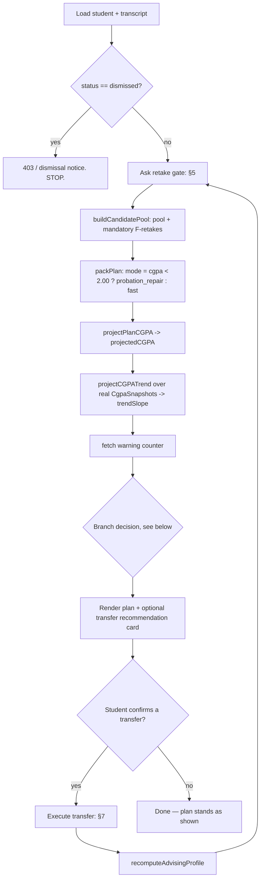
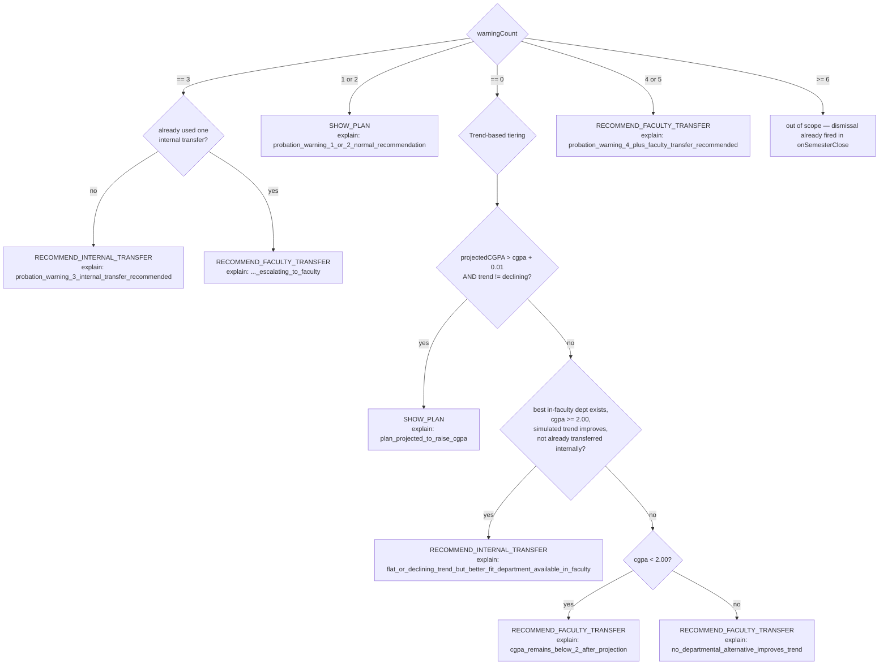

# Decision Tree — the §4.2 / §8 advising flow

This is the `runAdvisingCycle` flow (spec §8's end-to-end orchestration,
§4.2's branch decision, and `AMENDMENT 1`'s warning-ladder override) drawn
as a diagram. Kept in sync with
[`advisingCycle.service.ts`](../packages/api/src/modules/advising/advisingCycle.service.ts)
— if you change the branch logic there, update this diagram in the same
commit.

## End-to-end orchestration (one "Advise Me" run)

## The branch decision (`decideAdvisingAction`)

`AMENDMENT 1` (the warning-ladder rule) takes precedence the moment the
student's counter is ≥ 1. Only a student at warning 0/6 falls through to the
original trend-based tiering.

## Reading this against the code

Every leaf in the second diagram corresponds to one `return` statement in
`decideAdvisingAction` (`advisingCycle.service.ts`), and the `explain`
string shown is exactly what the API returns — the frontend's
`TransferExplanationCard` translates each one into a plain-language
sentence (`packages/web/src/components/TransferExplanationCard.tsx`). If a
new explain string is ever added to the service, add its sentence there too
and update this diagram.

## Worked examples

Every branch above is exercised by a named example in `BUILD_SPEC.md` §11
and a corresponding demo persona in
[`inMemoryDb.ts`](../packages/api/src/db/memory/inMemoryDb.ts):

| Example | Persona | Branch reached |
|---|---|---|
| A | Ahmed | `SHOW_PLAN` (tier 1, trend-based) |
| B | Salma | retake-gate YES, chain-unlock-prioritized retake |
| C | Karim | retake-gate NO + mandatory F-retake |
| D | Omar | first sub-2.00 semester, warning 1/6 |
| E | (unit-tested directly) | mid-window counter recovery |
| F | Nourhan | dismissal at warning 6/6 |
| G | Yara | Level-1 half-load, first semester unarmed |
| H | Sara | `RECOMMEND_INTERNAL_TRANSFER` (trend-based tier 2) |
| I / K | Hassan | `RECOMMEND_FACULTY_TRANSFER` → external transfer execution |
| J | Sara (continued) | §4.2.1 anti-loop guard |
| L | (post-Hassan-transfer) | insufficient trend history → safe `SHOW_PLAN` |
| M | Fatma | mandatory-retake credit overflow |
| warning ladder 1–4 | Omar / Mona / Youssef / Laila | `AMENDMENT 1` tiers |
